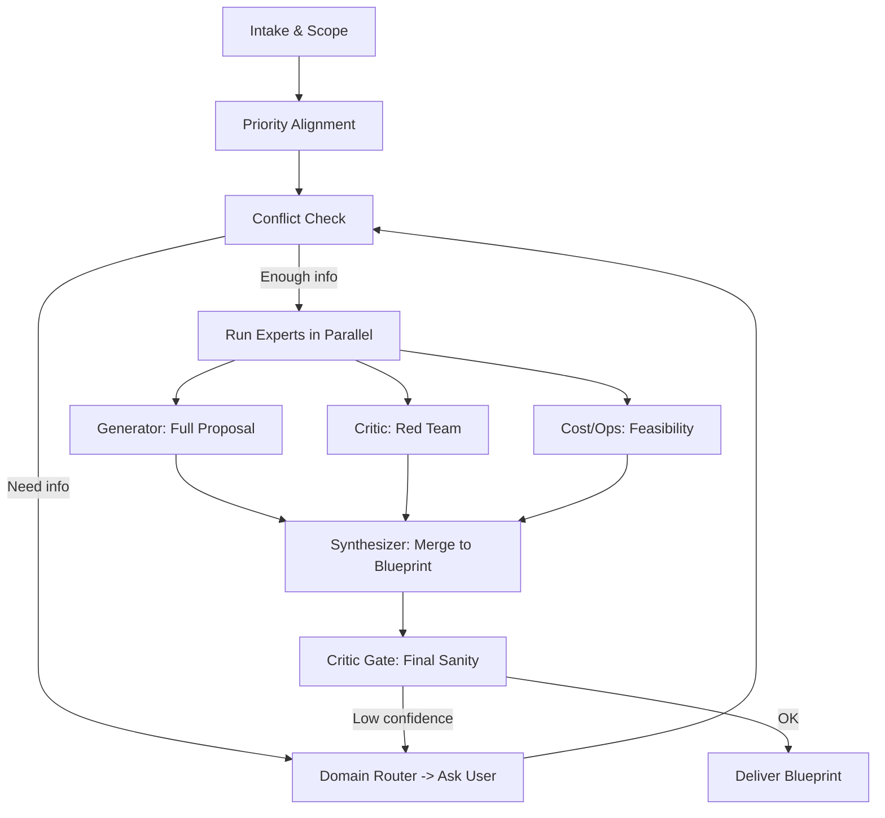

כן, זה אפשרי — והרעיון שלך (כמה סוכנים שמייצרים → מבקרים → ממזגים) הוא בדיוק משפחה של תבניות שנקראת לפעמים **“Ensemble / Debate / Critique-and-Refine”**.

אבל הייתי משנה לך את זה קצת כדי שזה יהיה גם **יעיל**, גם **לא ידרדר ל”טלפון שבור”**, וגם **ייתן תוצר סופי עקבי**.

---

## למה המבנה שהצעת עובד, ואיפה הוא עלול להישבר
מה טוב:
- כל מודל “רואה” אחרת: אחד יותר פרקטי, אחד יותר בטיחותי, אחד יותר יצירתי.
- ביקורת חיצונית משפרת איכות ומורידה הזיות.

מה הסיכון:
- סוכן 3 שקורא סוכן 1+2 ואז מוסיף “שלו” בלי תפקיד ברור עלול:
  - לחזור על אותם רעיונות
  - להכניס כיוונים חדשים בלי קשר לדרישות
  - להגדיל רעש במקום בהירות
- סיכום סופי (Agent 4) יכול לצאת “פשרה” לא טובה אם אין לו **כללי הכרעה**.

הפתרון: לא “עוד ועוד דעות”, אלא **תפקידים חדים + פורמט אחיד + שיטת ניקוד/הכרעה**.

---

## ארכיטקטורה מומלצת לשיתוף פעולה בין סוכנים (פשוטה וברורה)

### 0) רכיב מרכזי: Orchestrator / Supervisor (אתה)
זה לא “עוד סוכן”. זה מנהל תהליך.
תפקידו:
- מחזיק State אחד אמיתי (`ProjectContext`)
- מחלק משימות לסוכנים האחרים
- מאחד תשובות בפורמט אחיד
- מחליט מתי לעצור / לחזור לשאלות

חשוב: **ה־Supervisor לא “חושב הכי חזק” — הוא “מנהל הכי חכם”.**

---

## תצורה A (מומלצת): Generate → Critique → Merge → Sanity Check
זו גרסה שמביאה הרבה איכות עם מעט רעש.

### Agent 1 — “Solution Architect” (Generator)
מייצר הצעה מלאה: Pattern + Stack + Diagram + Roadmap + ADRs.

### Agent 2 — “Red Team Architect” (Critic)
לא מייצר פתרון חדש. רק:
- מוצא כשלים, סיכונים, נקודות לא ברורות
- מציע תיקונים ממוקדים
- מסמן “מה חייב לשאול את המשתמש”

### Agent 3 — “Cost & Ops Reality Check” (Feasibility)
מתמקד רק ב:
- עלות/מורכבות תפעול (bands)
- מה יכאב לצוות קטן/גדול
- חלופות זולות יותר (אם צריך)

### Agent 4 — “Blueprint Editor” (Synthesizer)
זה ה”עורך הראשי”:
- לוקח את 1 + הערות 2 + בדיקת 3
- מייצר מסמך סופי אחד עקבי
- מוסיף “Assumptions/Unknowns” + “Next steps”

למה זה עדיף מהשרשרת שלך?
כי כל סוכן תורם **זווית אחרת** במקום “עוד דעה כללית”.

---

## תצורה B (כשיש זמן ורוצים עומק): 2 הצעות מתחרות + שופט
אם אתה רוצה באמת לנצל 4 מודלים שונים:

### Agent 1 — Proposal A
### Agent 2 — Proposal B (ארכיטקטורה אחרת בכוונה)
### Agent 3 — Judge (Scorecard)
נותן ניקוד לפי קריטריונים קבועים:
- time-to-market
- cost
- ops complexity
- scalability
- security
- maintainability

### Agent 4 — Synthesizer
בונה “המלצה סופית”:
- או בוחר A/B
- או עושה “Best of both” אבל רק אם יש הצדקה

זה מצוין כשיש אי-ודאות (למשל: Modular Monolith מול Serverless-hybrid).

---

## הדבר הכי חשוב: פורמט תשובה אחיד לכל סוכן (כדי למנוע בלגן)
תכריח כל סוכן להחזיר JSON/מבנה קבוע, למשל:

- `recommendation`: מה לבחור
- `key_decisions`: 3–7 החלטות
- `risks`: סיכונים + mitigation
- `unknowns`: מה חסר
- `diagram_mermaid`: קוד Mermaid
- `cost_ops_band`: Low/Med/High
- `confidence`: 0–1

ככה ה־Supervisor יכול למזג בצורה “מכנית” ולא לפי תחושה.

---

## האם באמת אפשר “כל סוכן מודל אחר” (GPT / Claude / Gemini / Manus)?
ברמת עיקרון: כן, בשתי צורות:

1) **בפלטפורמה שתומכת Multi-provider routing**
ה־Supervisor שולח את אותה משימה ל־providers שונים ומקבל תשובות.

2) **בגישה “מודל אחד, פרסונות שונות”** (אם אין לך multi-provider בפועל)
עדיין אפשר לקבל הרבה מהיתרונות אם אתה מחקה תפקידים שונים באותו מודל:
- Architect
- Red-team
- Cost/Ops
- Editor

האיכות לרוב מגיעה יותר מה”תפקיד” ומהפורמט מאשר מהספק.

> נקודה חשובה: “Manus” הוא לא סטנדרט אחד אוניברסלי כמו GPT/Claude/Gemini — תלוי איפה אתה מריץ את זה ומה הגישה אליו. אבל כתפיסה של “מודלים שונים” זה תקין לגמרי.

---

## איך לחבר את זה למה שכבר מימשת (Practical wiring)
אתה כבר בנית Nodes. עכשיו:
- ה־Supervisor מפעיל את ה־Nodes המרכזיים (Intake / Priority / Conflict / Router).
- רק אחרי שיש מספיק מידע — הוא מפעיל במקביל:
  - Generator
  - Critic
  - Cost/Ops
- ואז מפעיל Synthesizer שמייצר Blueprint.

במילים פשוטות:
“קודם מבינים, אחר כך מזמנים ועדת מומחים, ואז עורך ראשי סוגר מסמך.”

---

## כללי בטיחות/איכות שממש כדאי להוסיף
- **Anti-loop:** מקסימום 2 סבבי ביקורת. מעבר לזה זה נהיה רעש.
- **No new requirements rule:** לסוכן מבקר אסור להוסיף דרישות חדשות בלי לסמן אותן כ־“Assumption/Option”.
- **Traceability:** כל החלטה במסמך הסופי חייבת להצביע לאיזה Requirement/Constraint היא קשורה.
- **Conflict gate:** אם יש קונפליקט High — לא מאשרים “Final” בלי שהמשתמש הכריע.

---

## כדי שאכוון אותך בדיוק: מה הסטאק שלך?
שתי שאלות קצרות:
1) אתה מריץ את זה ב־**LangGraph** (Python/TS) או משהו אחר?
2) יש לך בפועל אפשרות לקרוא ל־**יותר מספק LLM אחד** (OpenAI + Anthropic + Google), או שאתה רוצה תכנון שגם עובד עם ספק אחד?


---

כן, זה תרחיש מצוין ל־LangGraph, ובגלל שיש לך Multi‑provider (OpenAI/Anthropic/Google/וכו’) אתה יכול לבנות “ועדת מומחים” אמיתית שעובדת במקביל ואז עורך ראשי שמוציא Blueprint אחד עקבי.

להלן תכנון מומלץ, פשוט להבנה אבל מאוד פרודקשן-רדִי.

---

## 1) התבנית המנצחת: Supervisor + ועדת מומחים + עורך ראשי
תחשוב על זה כמו מערכת חדשות (וזה גם מתחבר לעבודה שלך, מומין):
- כתב שטח מביא טיוטה
- עורך בודק סתירות וחורים
- מנהל מערכת בודק עלויות/היתכנות
- עורך ראשי מוציא כתבה סופית אחת

ב־Architect Agent זה נראה כך:

1) **Supervisor (Orchestrator)** – לא מודל “הכי חכם”, אלא מנהל התהליך
2) **Architect (Generator)** – מציע ארכיטקטורה מלאה
3) **Red Team (Critic)** – מוצא כשלים/סיכונים/שאלות חסרות
4) **Cost & Ops (Feasibility)** – נותן “בדיקת מציאות” על עלות/מורכבות תפעול
5) **Synthesizer (Blueprint Editor)** – ממזג למסמך אחד עקבי

העיקרון: *לא* “עוד דעה”, אלא **תפקידים חדים**.

---

## 2) LangGraph Flow מומלץ (ויזואלי וברור)



מה חשוב פה:
- ה־“מומחים” רצים **במקביל** (חוסך זמן, מעלה איכות).
- יש **Gate** בסוף שמחליט אם צריך עוד שאלה אחת-שתיים, במקום להוציא מסמך חצי-ניחוש.

---

## 3) איך לחלק ספקי מודלים (OpenAI/Claude/Gemini) בצורה חכמה
לא סתם “כל סוכן מודל אחר”, אלא התאמה לפי חוזקות:

- **Generator (Architect)** → מודל “חזק ביצירה ותכנון” (לרוב GPT או Claude)
- **Critic (Red Team)** → מודל עם נטייה טובה לביקורת/דיוק (Claude הרבה פעמים מצטיין בזה)
- **Cost & Ops** → מודל שעושה טוב פירוק לרכיבים ושיקולי תפעול (GPT/Gemini שניהם יכולים, תלוי אצלך)
- **Synthesizer (Editor)** → מודל שמצטיין בכתיבה עקבית ומסודרת (GPT או Claude)

טיפ פרקטי:
אם אתה רואה שמודל אחד “ממציא” יותר—שים אותו ב־Generator, ואת ה־Critic תן למודל השמרן יותר שיעצור הזיות.

---

## 4) הדבר שהופך את זה ליציב: “פורמט פלט אחיד” לכל סוכן
כדי שה־Supervisor יוכל למזג בלי כאוס, תכריח כל סוכן להחזיר JSON באותו מבנה (או Pydantic schema).

דוגמה קלה (מינימלית אבל חזקה):

- `summary`
- `pattern_recommendation`
- `key_decisions[]` (3–7)
- `tech_stack[]` (טבלה)
- `risks[]` (סיכון + חומרה + mitigation)
- `unknowns[]` (מה חסר)
- `mermaid_diagram`
- `cost_band` (low/med/high)
- `ops_band` (low/med/high)
- `confidence` (0–1)

כל סוכן מחויב להחזיר את זה.
ה־Synthesizer “מרכיב כתבה” מתוך שדות, לא מתוך טקסט חופשי.

---

## 5) שיטת הכרעה (איך ה־Synthesizer מחליט “מי צודק”)
כאן הרבה מערכות נופלות, אז שווה להגדיר כלל פשוט:

### 5.1 Scorecard (מומלץ)
ה־Supervisor מייצר “משקולות” מה־PriorityAlignment, למשל:
- time_to_market: 5
- cost: 4
- scale: 2
- security: 3
- ops_complexity: 4

ואז:
- לכל הצעה נותנים ניקוד לפי הקריטריונים
- בוחרים את ההצעה המנצחת
- או עושים “Best of both” **רק** אם אין סתירה בין ההחלטות

### 5.2 חוק זהב למיזוג
מותר למזג רק אם:
- זה לא מוסיף מורכבות תפעול בלי צורך
- זה לא מוסיף שירות/טכנולוגיה שאין לה הצדקה בדרישות
- כל החלטה במסמך הסופי קשורה ל־Requirement/Constraint

---

## 6) דוגמת Nodes ב־LangGraph (מה אתה מממש בפועל)
ברמה פרקטית, הייתי מגדיר:

- `intake_node` (LLM אחד, קצר)
- `priority_node` (LLM/טופס מהיר)
- `conflict_node` (LLM + כללים)
- `router_node` (מחליט אם לשאול עוד)
- `experts_parallel_node` (שלוש קריאות LLM במקביל: generator/critic/cost)
- `synthesizer_node` (מיזוג למסמך Blueprint)
- `final_gate_node` (בדיקה אם confidence מספיק + אם יש unknowns קריטיים)

---

## 7) שלושה Guardrails קטנים שחוסכים המון כאב
1) **No New Requirements Rule למבקר**
ל־Critic אסור להוסיף “פיצ’רים חדשים”. אם הוא רוצה—שיסמן כ־Option.

2) **Max 2 Iterations**
יותר מזה נהיה רעש. אם אחרי 2 סבבים אין confidence—מעלים “צריך החלטה אנושית”.

3) **Conflict Gate**
אם יש Conflict חומרה גבוהה (High) — לא יוצאים למסמך סופי בלי הכרעה של המשתמש.

---

## 8) הצעה הכי פרקטית להתחלה (MVP של המערכת)
כדי לא להיתקע בבנייה ארוכה:
- תבנה קודם **4 סוכנים בלבד**: Generator + Critic + Cost/Ops + Synthesizer
- תוסיף Router/Intake מינימלי
- רק אחרי שזה עובד—תוסיף “Proposal B” מתחרה או “Security specialist”.

---

## שאלה אחת כדי שאכוון אותך בדיוק
אתה רוצה שהמומחים ירוצו:
- **אופציה 1:** “אותו Prompt, מודלים שונים” (השוואה נקייה בין ספקים)
או
- **אופציה 2:** “Prompts שונים לפי תפקיד” (יותר שליטה, בדרך כלל יותר איכות)

אם תענה 1 או 2, אני אתן לך תכנון מדויק של:
- ה־Pydantic schemas לפלט של כל סוכן
- ה־routing logic (מתי לשאול עוד שאלות)
- ודוגמת Prompt קצרה לכל סוכן (בעברית/אנגלית לפי מה שנוח לך).

תענה לי על 2 השאלות, ואני אתן לך תרשים Flow סופי + דוגמת JSON schema לפלט של כל סוכן + כללי merge ברורים.


---


מעולה. הנה תכנון “Prompts שונים לפי תפקיד” לתצורה A שלך, בצורה שאפשר ממש להדביק ל־LangGraph: לכל סוכן יש מטרה אחת חדה, פורמט פלט אחיד (JSON), וחוקי משחק שמונעים רעש.

כדי שזה יהיה קל ליישום, אני נותן:
- תבנית **State** מינימלית להעברה בין הסוכנים
- **4 Prompts** (Agent 1–4) לפי התפקידים שלך
- “כללי Merge” פשוטים שה־Synthesizer (Agent 4) מבצע
- Gate סופי (Sanity Check) קצר

---

## 0) העיקרון שמחזיק את הכל: Output Schema אחיד
אל תיתן לכל מודל “לכתוב איך שבא לו”. תכריח את כולם להחזיר JSON באותו מבנה. זה מה שהופך את המערכת ליציבה.

### JSON Schema מומלץ (פשוט אבל מספיק)
כל Agent מחזיר אובייקט כזה:

```json
{
  "agent_role": "solution_architect | red_team | cost_ops | editor",
  "executive_summary": "string",
  "architecture_pattern": {
    "name": "string",
    "why": ["string"]
  },
  "tech_stack": [
    { "layer": "frontend|backend|db|cache|messaging|auth|infra|ci_cd|observability|ai", "choice": "string", "reason": "string" }
  ],
  "key_decisions": [
    { "id": "ADR-001", "decision": "string", "rationale": "string", "consequences": ["string"] }
  ],
  "diagram_mermaid": "string",
  "roadmap": [
    { "phase": "MVP|Hardening|Scale", "items": ["string"] }
  ],
  "risks": [
    { "risk": "string", "severity": "low|medium|high", "mitigation": "string" }
  ],
  "unknowns": [
    { "question": "string", "impact": "low|medium|high", "why_it_matters": "string" }
  ],
  "cost_ops": {
    "cost_band": "low|medium|high",
    "ops_band": "low|medium|high",
    "top_cost_drivers": ["string"],
    "top_ops_pains": ["string"],
    "cheaper_alternatives": ["string"]
  },
  "confidence": 0.0
}
```

הערה פרקטית: אם אתה עובד עם Structured Output (Pydantic) — מצוין. אם לא, עדיין אפשר לבקש “JSON בלבד”.

---

## 1) Agent 1 — “Solution Architect” (Generator) — Prompt
מטרת הסוכן: לייצר הצעה מלאה אחת, פרקטית, לא “חלומות”.

**SYSTEM / ROLE (אפשר לשים כסיסטם לפרויקט/Agent):**
> אתה Senior Solution Architect. המטרה שלך להציע ארכיטקטורה מעשית, סקיילבילית לפי הצורך, חסכונית ככל האפשר, עם מסלול התפתחות. אתה לא מבקר ולא מתווכח—אתה מציע פתרון אחד מומלץ.

**USER PROMPT TEMPLATE:**
```text
קלט:
- ProjectContext (JSON): {{project_context_json}}

משימה:
1) תן המלצה אחת לארכיטקטורה (Pattern) שמתאימה לדרישות והאילוצים.
2) תן Tech Stack לפי שכבות (frontend/backend/db/cache/messaging/auth/infra/ci_cd/observability/ai).
3) כתוב 3–6 ADRs קצרים (החלטות מפתח).
4) צור Mermaid diagram אחד ברור (flowchart) שמציג את הרכיבים והזרימות.
5) תן Roadmap ב-3 פאזות: MVP → Hardening → Scale.
6) ציין 3–6 סיכונים אמיתיים + mitigation.
7) ציין Unknowns (שאלות חסרות) רק אם הן באמת Impact גבוה.

כללים:
- תהיה פרקטי: הימנע מטכנולוגיות כבדות אם אין הצדקה.
- אל תוסיף דרישות חדשות. אם אתה מניח משהו—שים אותו ב-unknowns או ציין כ-assumption במשפט.
- החזר JSON בלבד לפי הסכימה שסופקה.
```

---

## 2) Agent 2 — “Red Team Architect” (Critic) — Prompt
מטרת הסוכן: לא להציע “פתרון אחר”, אלא לפרק את ההצעה ולשפר אותה.

**SYSTEM / ROLE:**
> אתה Red Team Architect. אתה לא מתכנן מערכת מאפס. אתה תוקף את ההצעה הקיימת: מוצא כשלים, סיכונים, נקודות מעורפלות, חוסרים, והמלצות תיקון ממוקדות. המטרה: להפוך את ההצעה לבטוחה יותר, ישימה יותר, וברורה יותר.

**USER PROMPT TEMPLATE:**
```text
קלט:
- ProjectContext (JSON): {{project_context_json}}
- Proposal של Solution Architect (JSON): {{agent1_json}}

משימה:
1) מצא חורים/כשלים/סתירות/הנחות לא מבוססות בהצעה.
2) תן תיקונים ממוקדים (לא "תבנה מחדש"). אם משהו חייב להשתנות—תגיד בדיוק מה ולמה.
3) תן רשימת Unknowns שחייב לשאול את המשתמש לפני שמתחייבים (עם impact ולמה זה משנה החלטה).
4) תן "Top 5 Failure Modes": מה יישבר ראשון בפרודקשן.
5) אל תוסיף Tech Stack חדש בלי הצדקה—הצע רק תיקון נקודתי.

כללים:
- אסור להחליף את כל הארכיטקטורה. אתה מבקר ומשפר.
- כל טענה שלך חייבת להיות קשורה לדרישה/אילוץ או לסיכון תפעולי ברור.
- החזר JSON בלבד לפי הסכימה. אם אין לך tech_stack משלך—השאר כפי שהוא או תן תיקון נקודתי בתוך reason.
```

---

## 3) Agent 3 — “Cost & Ops Reality Check” (Feasibility) — Prompt
מטרת הסוכן: בדיקת מציאות. Bands, כאבי תפעול, והורדת מורכבות אם אפשר.

**SYSTEM / ROLE:**
> אתה Cost & Ops Architect. אתה מסתכל רק על עלות, תפעול, מורכבות, יציבות, ויכולת צוות. אתה לא מחפש “הכי יפה”, אלא “הכי ישים”.

**USER PROMPT TEMPLATE:**
```text
קלט:
- ProjectContext (JSON): {{project_context_json}}
- Proposal של Solution Architect (JSON): {{agent1_json}}

משימה:
1) תן cost_band (low/medium/high) והסבר קצר למה.
2) תן ops_band (low/medium/high) והסבר קצר למה.
3) רשום top_cost_drivers ו-top_ops_pains (3–7 כל אחד).
4) אם יש דרך זולה/פשוטה יותר להגיע ל-MVP בלי לפגוע בדרישות קריטיות—הצע cheaper_alternatives.
5) הצע 3–5 “Risk reducers” תפעוליים (למשל: managed DB, staged rollout, limits, caching strategy).

כללים:
- אל תמציא מחירים במספרים אם אין נתוני עומס מדויקים; השתמש בבנדים.
- אל תציע Kubernetes/Microservices אם אין הצדקה חזקה—ואם כן, תסביר למה זה בלתי נמנע.
- החזר JSON בלבד לפי הסכימה.
```

---

## 4) Agent 4 — “Blueprint Editor” (Synthesizer) — Prompt
מטרת הסוכן: להוציא מסמך אחד עקבי, עם הכרעות ברורות.

**SYSTEM / ROLE:**
> אתה Blueprint Editor (עורך ראשי). אתה מקבל הצעה + ביקורת + בדיקת עלות/תפעול, ומוציא Blueprint אחד סופי: ברור, עקבי, ישים. אתה אחראי על הכרעה כשיש מחלוקת.

**USER PROMPT TEMPLATE:**
```text
קלט:
- ProjectContext (JSON): {{project_context_json}}
- Proposal (Agent1 JSON): {{agent1_json}}
- Critique (Agent2 JSON): {{agent2_json}}
- Cost/Ops (Agent3 JSON): {{agent3_json}}

משימה:
1) הפק “Final Blueprint” מאוחד: תיקח את ההצעה של Agent1 כבסיס, ותיישם את התיקונים של Agent2/3 אם הם מוצדקים.
2) כשיש סתירה בין הסוכנים:
   - תעדיף את מה שמתאים יותר ל-priorities ול-constraints.
   - אם חסר מידע קריטי להכרעה—הוסף Unknowns עם impact=high במקום לנחש.
3) הוסף:
   - Assumptions (3–8) אם יש הנחות שהמערכת נשענת עליהן
   - Unknowns (רק מה שבאמת משנה החלטה)
   - Next steps (5–10 צעדים קונקרטיים)
4) שמור Mermaid diagram אחד נקי (תעדכן אם צריך).
5) השאר ADRs סופיים (3–6) עקביים.

פלט:
- החזר JSON בלבד לפי הסכימה.
- בנוסף, בתוך executive_summary תן 4–8 שורות בעברית פשוטה שמסכמות את ההחלטה.
```

---

## 5) Sanity Check Gate (אופציונלי אבל מומלץ)
אחרי Agent 4, תריץ “Final Gate” קצר (יכול להיות אותו מודל או מודל אחר):

**מטרה:** לוודא שאין חורים לפני שמציגים למשתמש.

**כללים להחלטה:**
- אם `confidence < 0.7` → חזרה ל־DomainRouter עם 2–4 שאלות Impact-high
- אם יש `unknowns` עם impact=high יותר מ־3 → לעצור ולבקש תשובות
- אם cost_band=high ו־decision_profile הוא MVP_FAST או COST_FIRST → להחזיר תיקון/הצעה להורדת מורכבות

---

## 6) איך להריץ את זה ב־LangGraph (ממש בקצרה)
- Node “Intake/Priority/Conflict/Router” מעדכן `ProjectContext`.
- אחר כך `parallel` / fan-out לשלושת המומחים:
  - call Agent1 (Generator)
  - call Agent2 (Critic) עם Agent1 output
  - call Agent3 (Cost/Ops) עם Agent1 output
- ואז Node Agent4 (Synthesizer) שמקבל את שלושתם ומחזיר Final JSON.
- ואז Gate (אופציונלי) שמחליט deliver או עוד שאלות.

---

## 7) טיפ קטן שיעשה לזה “רמה של מוצר פנימי”
ב־ProjectContext תוסיף שדה אחד:
- `decision_profile` + `priorities`
ואז ב־Synthesizer תן כלל:
“בכל התלבטות — מי שמנצח הוא מי שמתאים ל־priorities”.

זה מונע “פשרות לא עקביות”.

---

אם תרצה, תשלח לי את ה־ProjectContext שלך (דוגמה אמיתית/מוחרגת פרטים) ואני אנסח לך את 4 הפרומפטים בדיוק בהתאם לשדות שאתה משתמש בהם היום, כדי שלא תצטרך לעשות התאמות ידניות.


---


כרגע יש אצלי בעיה הגרף נכנס ללופ - ה-critic מחזיר confidence=0.30 וממליץ revise_pattern, אז הגרף חוזר לאחור וחוזר על כל התהליך. זה קרה 4+ פעמים עד שהגיע ל-recursion limit.
הבעיה המרכזית היא שה-confidence נשאר נמוך ולכן הוא לא מסיים.

במימוש של המולטי אייגנט זה לא יקרה?

---

כן — במולטי‑אייג׳נט זה *יכול עדיין לקרות* אם אתה משאיר את אותו “חוק חזרה אחורה” (confidence נמוך ⇒ חוזרים להתחלה) בלי מנגנון עצירה/התקדמות. מה שמשנה הוא לא מספר הסוכנים, אלא **איך אתה מתרגם ביקורת ללמידה** ואיך אתה מונע מצב של “אותה ריצה שוב ושוב”.

הבעיה שלך נשמעת כמו לופ קלאסי של LangGraph:
ה־Critic נותן `confidence=0.30` + “revise_pattern”, והגרף חוזר ל־PatternSelection, אבל **אין שום מידע חדש** שנכנס ל־State, אז הוא מייצר שוב אותה תשובה, וה־Critic שוב לא מרוצה.

להלן פתרון פרקטי שעובד (בשפה פשוטה), כולל חוקים ברורים כדי שזה לא יקרה גם במולטי‑אייג׳נט.

---

## למה ה‑confidence נשאר נמוך (בדרך כלל)
זה כמעט תמיד אחד מהדברים האלו:
1) **חוסר מידע** (Unknowns) – המבקר אומר “אי אפשר להחליט” אבל במקום לעצור ולשאול, אתה מחזיר אחורה ומייצר שוב.
2) **הצעה לא משתנה באמת** – גם אחרי “revise_pattern” אתה חוזר לאותו pattern/stack כי אין מנגנון שמכריח שינוי.
3) **Critic קשוח מדי / לא מוגדר** – הוא תמיד מוצא משהו כדי להוריד confidence, גם כשזה “סביר”.
4) **אין “סף יציאה”** – אין מצב שבו אומרים: “זה מספיק טוב, יוצאים עם הסתייגויות”.

---

## איך מתקנים: 5 כללים שמבטלים לופים

### 1) אל תחזיר אחורה בגלל confidence נמוך — תחזיר אחורה רק אם יש “מה לעשות”
במקום:
- אם confidence נמוך ⇒ rerun

תעשה:
- אם confidence נמוך *וגם* קיימת פעולה ספציפית שיכולה לשפר (למשל: לשאול 2 שאלות, או לבחור מתוך shortlist אחר) ⇒ rerun
- אם confidence נמוך בגלל **חוסר מידע** ⇒ **Ask User** ולא rerun פנימי

כלל פשוט:
- `low_confidence_reason == "missing_info"` ⇒ שאל משתמש
- `low_confidence_reason == "bad_choice"` ⇒ החלף בחירה (עם forced change)
- `low_confidence_reason == "risk_acknowledged"` ⇒ אפשר לצאת עם “סיכונים/הנחות”

כדי שזה יעבוד, תוסיף ל־Critic שדה:
- `low_confidence_reason: missing_info | conflicting_constraints | weak_justification | wrong_pattern | other`

---

### 2) “Forced Progress”: אם חוזרים אחורה — חייב להשתנות משהו ב‑State
תוסיף ל־State:
- `revision_count`
- `last_pattern`
- `change_log[]` (מה השתנה ולמה)

חוק:
- אם חוזרים ל־PatternSelection פעמיים וה־pattern נשאר אותו דבר → אסור להמשיך. או שואלים משתמש, או בוחרים pattern חלופי.

---

### 3) “Shortlist” במקום “revise_pattern”
הביטוי `revise_pattern` הוא עמום מדי ומייצר לופ.

עדיף: שה־Generator תמיד מחזיר:
- `pattern_shortlist: [A,B,C]` עם ניקוד/התאמה

ואז ה־Critic לא אומר “revise_pattern” אלא:
- “בחר B במקום A” + 2 סיבות
או:
- “צריך מידע X כדי לבחור בין A/B”

זה הופך את החזרה אחורה למשהו **דטרמיניסטי** ולא רנדומלי.

---

### 4) “Exit with Assumptions”: מותר לסיים גם עם confidence בינוני
במציאות ארכיטקטורה היא הימור מושכל. לכן תגדיר:
- `confidence >= 0.7` ⇒ יציאה רגילה
- `0.5 <= confidence < 0.7` ⇒ יציאה עם סעיף “Assumptions + Risks + Next questions”
- `confidence < 0.5` ⇒ אסור לסיים בלי שאלות משתמש (כי חסר מידע קריטי)

ככה אתה לא נתקע על 0.68 לנצח.

---

### 5) Critic חייב להיות “Bounded”: לא לתת לו להוריד confidence בלי תנאים
תגדיר למבקר חוקים:
- אם אין Unknowns impact=high
- ואין conflicts high
- וההצעה עקבית עם priorities
אז `confidence` לא יכול להיות מתחת 0.6

כלומר, confidence הוא לא “תחושה”, אלא פונקציה של checks.

---

## אז האם במולטי‑אייג׳נט זה יפתור את זה?
לא אוטומטית. מולטי‑אייג׳נט בלי כללי anti‑loop יכול אפילו להחמיר (עוד ביקורת ⇒ עוד חוסר ביטחון).

אבל אם תעשה במולטי‑אייג׳נט את השינוי המרכזי הזה — זה כן נפתר:

### שינוי מרכזי במולטי‑אייג׳נט
במקום:
- Critic ⇒ “תחזור להתחלה”

תעשה:
- Critic ⇒ אחת משלוש פעולות בלבד:
  1) **ASK_USER** (עם 2–4 שאלות impact-high)
  2) **SWAP_OPTION** (לבחור חלופה מה‑shortlist)
  3) **ACCEPT_WITH_NOTES** (לסיים עם assumptions/risks)

כלומר, המבקר נותן “פקודה” ברורה ולא “ביקורת כללית”.

תוסיף לשדה ביקורת:
```json
"verdict": "accept | accept_with_notes | ask_user | swap_option",
"swap_to": "Modular Monolith"
```

---

## דוגמה קטנה (כדי להבין את ההבדל)
אם ה־Critic נותן 0.30 כי “לא ברור העומס”:
- במקום rerun → `verdict=ask_user` עם 3 שאלות, ואז ריצה אחת נוספת אחרי שיש תשובות.

אם ה־Critic נותן 0.30 כי “הבחירה ב‑Microservices לא מוצדקת”:
- במקום rerun כל התהליך → `verdict=swap_option` ל‑Modular Monolith, ואז Synthesizer מעדכן.

---


בינתיים יישמנו במימוש של הסוכן היחיד:

יישמתי את 5 הכללים למניעת לופים:

שינויים:

CriticAnalysis - הוספתי low_confidence_reason עם אפשרויות:

missing_info - צריך לשאול משתמש
conflicting_constraints - אילוצים סותרים
weak_justification - הצדקה חלשה
wrong_pattern - pattern לא מתאים
risks_acknowledged - סיכונים מודעים
ProjectContext - הוספתי:

revision_count - ספירת חזרות אחורה
last_pattern - ה-pattern האחרון
last_confidence_reason - סיבת confidence נמוך
route_from_critic - לוגיקה חדשה:

confidence >= 0.7 → יציאה רגילה
0.5 <= confidence < 0.7 → יציאה עם assumptions (לא לופ!)
confidence < 0.5 + missing_info → שאלת משתמש
revision_count >= 2 → מספיק, יוצאים
pattern == last_pattern → אין טעם לחזור
CRITIC_PROMPT - הנחיות לסיבת confidence נמוך

עכשיו המערכת תסיים מהר יותר ולא תיכנס ללופים אינסופיים.


---

## החלטה סופית איפה משבצים כל מודל


- Generator (Architect) → מודל “חזק ביצירה ותכנון” (Claude, רצוי מודל Opus)
- Critic (Red Team) → מודל עם נטייה טובה לביקורת/דיוק (Gpt)
- Cost & Ops → מודל שעושה טוב פירוק לרכיבים ושיקולי תפעול (Gemini3pro)
- Synthesizer (Editor) → מודל שמצטיין בכתיבה עקבית ומסודרת (Claude)
